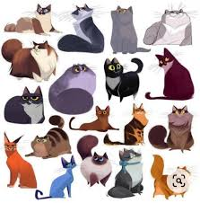

# Инструкция для работы с Markdown

## Выделение текста

чтобы выделить текст курсивом, необходимо обрамить его знаком (*) или знаком (_) *вот так* или же _вот так_

чтобы выделить текст полужирным шрифтом, необходимо обрамить его знаком (**)   
**вот так** или двойным знаком (_ _) __вот так__

альтернативные способы выделения текста нужны, чтобы совмещать оба варианта - может быть полужирный курсив. Например, *__вот так__*

## Списки
чтобы выделить ненумеровынные списки, , используйте звёздочку (*) или знак +  Например, вот так:
+ Эл 1
* Эл 2
+ Эл 3
* Эл 4

чтобы выделить нумерованные списки, необходимо пункты пронумеровать (пишем цифру и нажимаем точку и пробел), вот так:
1. Первый пункт
2. Второй пункт

и т.д.

## Работа с изображениями

чтобы вставить изображение в текст МД, достаточно написать следующее:  

## Ссылки

## Таблицы

## Цитаты

## Заключение